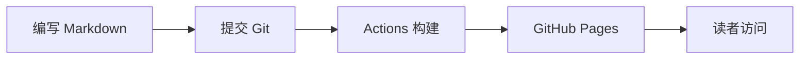

我希望这个小站能装下的东西，比一份文章列表多一点。

有些内容适合认真写成博客，有些只是还没想清楚的随笔；读过的书想留一份笔记，做过的项目想有个展示的地方，生活里的照片也值得好好收起来。于是，本站慢慢长成了现在的样子。

这篇文章从实际源码出发，介绍如何把它复刻成你自己的小站：先让网站运行起来，再替换个人信息，接着理解每个栏目如何维护，最后完成部署。

**只想开始写作，主要改配置和 Markdown 就够了；想调整交互和版式，再往 Vue 组件里走。** 不需要一开始就把所有前端知识学完。

本文以写作时仓库中的 **Valaxy 0.28.11 + valaxy-theme-yun 0.28.11** 为基础。文中的文件名都相对于仓库根目录；示例中的 `YOUR_USERNAME`、`你的名字`、图片路径和服务地址，都需要换成自己的内容。

<!-- more -->

## 一、先认识这个小站

### 1.1 基本框架与功能分工

本站使用 [Valaxy](https://valaxy.site/) 生成博客，使用 [Yun 主题](https://github.com/YunYouJun/valaxy/tree/main/packages/valaxy-theme-yun) 提供基础界面，再通过本地 Vue 组件扩展个性化功能。

| 部分 | 本站使用的方案 | 主要负责什么 |
| --- | --- | --- |
| 内容与页面 | Markdown、YAML Front Matter | 正文、文章信息、相册和项目数据 |
| 博客框架 | Valaxy 0.28.11 | 路由、内容处理、构建、搜索与订阅等能力 |
| 基础主题 | valaxy-theme-yun 0.28.11 | 首页、导航、文章页、归档、标签、分类等界面 |
| 自定义交互 | Vue 单文件组件、TypeScript | 全屏个人主页、项目抽屉、随笔卡片、翻转书架 |
| 样式 | SCSS、CSS 变量、UnoCSS | 主题覆盖、响应式布局、图标和动效 |
| 相册浏览 | valaxy-addon-lightgallery | 点击照片后进入大图浏览 |
| 评论 | valaxy-addon-twikoo | 将文章页连接到独立的 Twikoo 后端 |
| 发布 | GitHub Actions + GitHub Pages | 提交源码后构建并发布静态文件 |

网站主体是静态站点。文章保存在仓库里，构建后变成 HTML、CSS 和 JavaScript，访客打开这些文件就能浏览内容。**日常写作不依赖一个在线后台，也不需要为文章单独配置数据库。**

评论是另一条链路：评论内容由 Twikoo 后端保存，不在博客的 Markdown 文件中。图片既可以随仓库发布，也可以放在自己的对象存储或图床中。

```text
Markdown / Vue / 配置 / 图片
            ↓
       Valaxy 构建
            ↓
          dist/
            ↓
      静态网站托管平台
            ↓
        浏览器访问

浏览器中的评论区 → 你自己的 Twikoo 服务 → 评论数据
```

### 1.2 哪些是主题功能，哪些是本站定制

这一点会影响后续升级和搬迁，值得先分清楚。

- **主题提供的页面**：首页、博客列表、文章、分类、标签、归档、项目列表、相册列表和相册详情等。
- **本站增加的页面布局**：`layouts/grid.vue`、`layouts/shelf.vue`、`layouts/about.vue`。
- **本站增加的主要组件**：`PostGrid.vue`、`BookShelf.vue`、`AboutFleur.vue` 及其子组件。
- **本站覆盖的同名组件**：`YunAlbum.vue` 和 `VAPhoto.vue`，用来调整相册卡片与照片说明。

只安装 Valaxy 和 Yun，不会自动获得本站的完整外观。想保留这些定制，需要一起保留对应的 `components/`、`layouts/`、`composables/` 和 `styles/` 文件。

### 1.3 阅读路线

第一次搭站，可以按这个顺序操作：

1. 本地启动。
2. 替换站名、头像、链接等个人信息。
3. 写一篇自己的文章。
4. 根据需要保留个人主页、随笔、书架和相册。
5. 发布到自己的 GitHub Pages。
6. 最后接入评论、订阅和更多定制。

不必在第一天把每个栏目填满。先有一篇真正属于自己的内容，这个站就已经开始发挥作用了。

## 二、获取源码，在本地运行

### 2.1 准备环境

需要准备 Git、Node.js、pnpm，以及一个能编辑 Markdown 和 Vue 文件的编辑器。

**本仓库锁定的 Valaxy 0.28.11 要求 Node.js `>=22.12.0`。** 这个要求可以在依赖的 `package.json` 和仓库的 `pnpm-lock.yaml` 中找到。使用 Node 22 时，也要确认小版本不低于 22.12。

仓库的 GitHub Actions 使用 pnpm 9，下面也沿用这一版本。安装符合要求的 Node.js 后，在终端执行：

```bash
node -v
npm install -g pnpm@9
pnpm -v
git --version
```

这里用 npm 安装的是 pnpm 工具；项目本身的依赖统一交给 pnpm 管理。

仓库已经包含 `pnpm-lock.yaml`。保留它，可以让本地与部署环境安装同一组依赖。第一次复刻时，不需要顺手升级所有包，也不建议混用 npm、Yarn、pnpm 来安装项目依赖。

### 2.2 Fork 并克隆仓库

本站源码：[Alive0103 / Alive0103.github.io](https://github.com/Alive0103/Alive0103.github.io)。

如果打算部署到个人 GitHub Pages，可以先 Fork 到自己的账号下，再把仓库命名为 `YOUR_USERNAME.github.io`。这里的 `YOUR_USERNAME` 应替换成自己的 GitHub 用户名。本文以这种部署在域名根路径的方式为主。

然后克隆**自己账号下的仓库**：

```bash
git clone https://github.com/YOUR_USERNAME/YOUR_USERNAME.github.io.git
cd YOUR_USERNAME.github.io
pnpm install --frozen-lockfile
pnpm dev
```

终端会打印本地地址，默认通常是 `http://localhost:4859/`，实际以终端输出为准。打开它后，就可以边编辑边预览；停止本地服务使用 `Ctrl+C`。

`--frozen-lockfile` 表示按现有锁文件安装，不顺带重写依赖解析结果。如果确实修改过 `package.json` 中的依赖，再执行普通的 `pnpm install` 更新锁文件，并将两者一起提交。

### 2.3 常用命令

| 命令 | 对应行为 | 使用场景 |
| --- | --- | --- |
| `pnpm dev` | 启动 Valaxy 开发服务 | 日常写作和调整页面 |
| `pnpm build` | 调用 `build:ssg`，进行静态生成 | 准备发布 |
| `pnpm build:ssg` | 执行 `valaxy build --ssg` | 与当前默认构建相同 |
| `pnpm build:spa` | 执行 `valaxy build` | 明确需要单页应用产物时使用 |
| `pnpm serve` | 执行 `vite preview` | 预览已有的构建产物 |
| `pnpm rss` | 单独生成订阅文件 | 调整或检查 RSS 时使用 |

**`pnpm serve` 不负责构建，`pnpm dev` 也不能代替上线后的静态产物预览。** 两者面向的阶段不同。

仓库里仍有一些历史部署配置，后面的部署章节会说明与当前依赖不一致的地方。

### 2.4 目录结构

下面只列出日常维护最有用的部分：

```text
.
├── site.config.ts              # 站点资料与通用功能
├── valaxy.config.ts            # 主题、导航、Markdown、插件配置
├── package.json                # 依赖和运行命令
├── pnpm-lock.yaml              # 依赖锁文件
├── pnpm-workspace.yaml         # pnpm 工作区配置
├── .npmrc                      # pnpm 安装相关设置
├── pages/
│   ├── posts/                  # 博客文章：tech、work、things 等子目录
│   ├── essays/                 # 随笔与随笔入口
│   ├── books/                  # 读书笔记与书架入口
│   ├── about/index.md          # 个人主页入口
│   ├── projects/index.md       # 项目列表的数据
│   ├── albums/                 # 相册列表与各个相册
│   ├── links/index.md          # 友链
│   ├── world/index.md          # 看世界
│   ├── sponsors/index.md       # 赞助者页面
│   ├── archives/index.md       # 归档
│   ├── categories/index.md     # 分类
│   └── tags/index.md           # 标签
├── components/
│   ├── AboutFleur.vue          # 个人主页总装
│   ├── AboutFleur/             # 个人主页各个区块
│   ├── GlobalPortfolioLauncher.vue
│   ├── PostGrid.vue            # 随笔卡片
│   ├── BookShelf.vue           # 翻转书架
│   ├── YunAlbum.vue            # 相册卡片覆盖
│   └── VAPhoto.vue             # 照片卡片覆盖
├── composables/usePortfolio.ts # 项目抽屉的共享状态
├── layouts/                   # about、grid、shelf 三种自定义布局
├── styles/                    # 全局样式覆盖与变量
├── public/                    # 按原路径发布的静态资源
├── locales/                   # 自定义语言文本
└── .github/workflows/gh-pages.yml
```

`node_modules/` 是安装出来的依赖，`dist/` 是构建产物，`.valaxy/` 中有框架生成的信息。日常修改从源码目录入手，不要直接改这些生成文件。

## 三、把站点改成自己的

### 3.1 两份配置分别管什么

- `site.config.ts`：站点是谁、叫什么、在哪里，以及搜索、摘要、阅读统计、评论和赞助等通用设置。
- `valaxy.config.ts`：使用什么主题、导航怎么排列、Markdown 怎么渲染，以及接入哪些插件。

两者会一起生效。修改站名时只改一个文件，往往会出现侧栏变了、首页大标题还没变的情况。

### 3.2 替换站点资料

下面是 `site.config.ts` 的一份基础示例。在现有文件中替换对应内容即可，也可以将其作为精简配置使用：

```ts
import { defineSiteConfig } from 'valaxy'

export default defineSiteConfig({
  url: 'https://YOUR_USERNAME.github.io/',
  lang: 'zh-CN',
  title: '我的小站',
  description: '记录技术、生活与一些还没想清楚的事。',
  subtitle: '慢慢写，慢慢生长。',
  favicon: '/favicon.svg',
  author: {
    name: '你的名字',
    email: 'you@example.com',
    avatar: '/images/avatar.png',
    status: {
      emoji: '🌱',
      message: '持续学习中',
    },
    intro: '你好，欢迎来到我的小站。\n这里有我的记录与思考。',
  },
  social: [
    {
      name: 'GitHub',
      link: 'https://github.com/YOUR_USERNAME',
      icon: 'i-ri-github-line',
      color: '#6e5494',
    },
    {
      name: 'E-Mail',
      link: 'mailto:you@example.com',
      icon: 'i-ri-mail-line',
      color: '#8E71C1',
    },
  ],
  search: { enable: true, provider: 'local' },
  statistics: { enable: true },
  excerpt: { type: 'html', auto: true, length: 200 },
  comment: { enable: false },
  sponsor: { enable: false },
})
```

把自己的头像放在 `public/images/avatar.png`，上面的路径才会对应到真实文件。`url` 填最终对外访问的地址，并保留结尾的 `/`；它会被订阅、站点地图等功能使用，不要一直留着原作者的域名。

示例先关闭评论和赞助，方便你完成个人信息替换。等自己的评论服务和收款图片准备好，再分别开启。

本站的作者简介支持换行，是因为 `styles/index.scss` 为 `.site-author-intro` 设置了 `white-space: pre-line`。

### 3.3 修改主题标题、导航和快捷入口

在 `valaxy.config.ts` 的 `themeConfig` 中修改：首页横幅用 `banner.title`，导航用 `nav`，主题中的页面快捷入口用 `pages`。

下面是字段结构示例，需要合并到现有的 `themeConfig` 中：

```ts
themeConfig: {
  type: 'nimbo',
  banner: { enable: true, title: '我的小站' },
  nav: [
    { text: '博客', link: '/posts/', icon: 'i-ri-article-line' },
    { text: '随笔', link: '/essays/', icon: 'i-ri-quill-pen-line' },
    { text: '书架', link: '/books/', icon: 'i-ri-book-2-line' },
    { text: '关于我', link: '/about/', icon: 'i-ri-user-line' },
  ],
  pages: [
    {
      name: '书架',
      url: '/books/',
      icon: 'i-ri-book-2-line',
      color: '#B0793A',
    },
  ],
  footer: {
    since: 2026,
    beian: { enable: false },
  },
},
```

注意两组数据的键名不同：导航是 `text`、`link`，快捷入口是 `name`、`url`。

**删除导航项只会移除入口，不会删除页面。** 如果某个栏目暂时不用，可以先隐藏入口；不想发布其中的示例内容，就需要同时整理对应 Markdown 文件。

### 3.4 一次性检查所有个人内容

| 位置 | 需要替换的内容 |
| --- | --- |
| `site.config.ts` | 作者名、邮箱、头像、站名、社交链接、二维码、赞助图片 |
| `valaxy.config.ts` | 横幅标题、建站年份、导航、Twikoo 环境配置 |
| `components/AboutFleur.vue` | 个人主页首屏的名字与标语 |
| `components/AboutFleur/IntroSection.vue` | 自我介绍、头像、照片说明 |
| `components/AboutFleur/FooterSection.vue` | 联系方式、终端式文案、署名 |
| `components/AboutFleur/PortfolioModal.vue` | 项目抽屉中的项目数据 |
| `pages/projects/index.md` | 独立项目页中的项目数据 |
| `pages/albums/` | 相册标题、封面、照片和说明 |
| `pages/links/index.md` | 友链来源与页面描述 |
| `pages/about/site.md` | 关于站点的介绍 |
| `pages/posts/`、`pages/essays/`、`pages/books/` | 原有文章与示例笔记 |
| `public/` | favicon、应用图标等静态资源 |

可以用编辑器的全局搜索检查 `Alive0103`、`alive0103`、`温铮`、`王越洋`、`wenzheng`、`972477867`、`wyy-alive-0o0` 和 `FLEUR`。名字之外，也要检查图片、GitHub 项目链接和评论服务地址。

页面底部显示的文章许可配置，和仓库代码的许可不是同一件事。使用框架、主题及第三方素材时，保留相应的来源和许可说明；示例文章、个人照片与联系方式则换成自己的。

## 四、写文章：文件、路由与 Front Matter

### 4.1 一份 Markdown 对应一个页面

| 源文件 | 访问路径 |
| --- | --- |
| `pages/posts/tech/hello-valaxy.md` | `/posts/tech/hello-valaxy` |
| `pages/essays/a-small-note.md` | `/essays/a-small-note` |
| `pages/books/my-first-book.md` | `/books/my-first-book` |
| `pages/about/index.md` | `/about/` |
| `pages/albums/travel/index.md` | `/albums/travel/` |

中文文件名也可以使用，浏览器复制地址时可能显示经过编码的中文路径。如果希望链接简洁稳定，可以采用英文文件名，将中文标题放进 Front Matter。

**文件名和所在目录影响链接，`title` 影响显示标题。** 文章发布后修改标题通常不必修改文件名；移动文件或改名，则要一并处理旧链接和按路径关联的评论。

首页和 `/posts/` 列表由框架与主题提供，所以仓库里没有自己编写的 `pages/index.md`、`pages/posts/index.md`，页面依然可以存在。

### 4.2 新建第一篇文章

例如创建 `pages/posts/tech/hello-valaxy.md`：

```md
---
title: 我的第一篇博客
date: '2026-10-03 10:00:00'
updated: '2026-10-03 10:00:00'
categories: 技术
tags:
  - 博客搭建
  - Valaxy
description: 记录我搭建个人博客的第一步。
cover: /images/posts/hello-valaxy.webp
draft: false
---

这是文章的开头，也可以作为列表里的摘要。

<!-- more -->

## 为什么想写博客

从这里开始写正文。

## 第一件想记录的事

记录具体的经历、思考与结论。
```

图片需要真实存在于 `public/images/posts/hello-valaxy.webp`；不准备封面时，直接删掉 `cover` 这一行。

文件最上方两条 `---` 之间的区域叫 Front Matter，使用 YAML 语法。键值之间用英文冒号，嵌套用空格缩进；带有 `: `、`#` 等特殊内容的文本用引号包起来更清晰。`draft`、`comment` 等布尔字段直接写 `true` 或 `false`，不要写成字符串。

### 4.3 常用字段速查

| 字段 | 用途 | 说明 |
| --- | --- | --- |
| `title` | 显示标题 | 可以与文件名不同 |
| `date` | 发布时间 | 文章列表和自定义卡片排序都会用到 |
| `updated` | 更新时间 | 内容有实质修改时更新 |
| `categories` | 分类 | 字符串表示单个分类；数组表示逐级分类 |
| `tags` | 标签 | 数组，可填写多个平行标签 |
| `description` | 内容简介 | 可用于页面元信息；书架卡片也会读取 |
| `excerpt` | 手动摘要 | 优先于正文摘要，普通文本最容易维护 |
| `excerpt_type` | 正文摘要的渲染方式 | 例如 `html`、`text`；手动 `excerpt` 不受它控制 |
| `cover` | 封面 | 文章页及部分卡片展示使用 |
| `draft` | 草稿状态 | `true` 时供开发预览，生产页面会过滤 |
| `top` | 文章置顶权重 | 数值越大越靠前；不控制本站自定义卡片的日期排序 |
| `comment` | 当前页是否展示评论 | `false` 可以单独关闭，仍受全站开关影响 |
| `sponsor` | 当前页是否展示赞助 | 普通页面可用 `false` 关闭 |
| `toc` | 目录开关 | 在使用主题目录的页面上生效 |
| `layout` | 页面布局 | 例如 `post`、`grid`、`shelf`、`gallery` |

分类不是磁盘目录的自动映射。把文章放进 `pages/posts/tech/`，还需要写 `categories: 技术`，它才会按这个分类展示。

如果写成：

```yaml
categories:
  - 技术
  - 前端
tags:
  - Vue
  - Valaxy
```

分类表达的是「技术 → 前端」的层级关系，标签则是两项平行标记。

### 4.4 摘要从哪里来

本站已开启自动摘要，默认使用 HTML 形式，截取长度配置为 200。日常写作可以从三种方式里选一种：

1. 用 `excerpt` 手动写一段简介。
2. 在正文中放 `<!-- more -->`，把前面的内容作为摘要来源。
3. 都不写，交给当前的自动摘要配置截取。

摘要最好是一段能独立阅读的话。尤其是教程，直接从目录或大段代码截取，列表里的阅读体验通常不太好。

### 4.5 博客、随笔与读书笔记为什么分开

本站的常规博客列表主要取自 `pages/posts/`，而随笔和书架读取的是更广泛的页面列表，再按路径筛选。

- 正式博客文章放进 `pages/posts/`。
- 随笔放进 `pages/essays/`，进入随笔卡片页。
- 读书笔记放进 `pages/books/`，进入书架。

给随笔加上 `categories: 技术`，不会因此把它变成博客列表中的文章。**栏目收录由组件和目录规则决定，分类字段负责另一层组织。** 当前默认 RSS 也只扫描 `pages/posts/` 下的 Markdown。

如果想让某类内容同时出现在博客和独立卡片页，可以把内容统一放在 `pages/posts/某个目录/`，再让卡片页的 `folder` 指向 `posts/某个目录`。这样不用复制两份正文。

### 4.6 草稿不等于私密内容

`draft: true` 适合控制网站发布进度，开发环境可以看到，生产路由和文章列表会过滤。

但如果源仓库公开，Markdown 原文依然在仓库中。草稿开关、隐藏列表和页面密码都不能让公开仓库中的源文件变成私人笔记。

## 五、个人主页与项目展示

### 5.1 个人主页是独立的 Vue 页面

`pages/about/index.md` 很短：

```md
---
title: 关于我
layout: about
---

<AboutFleur />
```

它负责选择布局并挂载组件，真正的页面由以下几层组成：

```text
pages/about/index.md
    ↓ layout: about
layouts/about.vue
    ↓
components/AboutFleur.vue
    ├── HeroSection.vue
    ├── IntroSection.vue
    ├── WorksSection.vue
    ├── PlaygroundSection.vue
    ├── StickerLayer.vue
    ├── FooterSection.vue
    └── GlobalPortfolioLauncher.vue
            └── PortfolioModal.vue
```

所以，修改 `site.config.ts` 中的作者信息，并不会同步修改这张个人主页里的所有文本。这里的内容目前直接维护在组件中。

### 5.2 修改个人主页的各个部分

| 想改什么 | 修改位置 |
| --- | --- |
| 首屏问候、名字、标语 | `AboutFleur.vue` 中的 `heroTitle`、`heroName`、`heroTagline` |
| 首屏字效和鼠标交互 | `AboutFleur/HeroSection.vue` |
| 自我介绍与拍立得头像 | `AboutFleur/IntroSection.vue` |
| 三组理念卡片与文案 | `AboutFleur/WorksSection.vue` 中的 `works` 数组 |
| 卡片中的视觉海报 | `AdaptivePoster.vue`、`DesignPrinciplesPoster.vue`、`HumanEdgePoster.vue` |
| 点击生成贴纸的区域 | `AboutFleur/PlaygroundSection.vue` |
| 贴纸种类和运动逻辑 | `AboutFleur/StickerLayer.vue` |
| 底部终端式联系信息 | `AboutFleur/FooterSection.vue` |
| 项目抽屉中的内容 | `AboutFleur/PortfolioModal.vue` |

例如，首屏文案只需要改这三个变量：

```ts
const heroTitle = 'Hello World'
const heroName = '你的名字'
const heroTagline = '记录一些值得留下的事'
```

主页配色集中在 `AboutFleur.vue` 的 `.fleur` 样式中：

```css
.fleur {
  --seed-bg: #0B0A1E;
  --seed-bg-elevated: #141330;
  --seed-fg: #F4ECDC;
  --seed-fg-muted: #9C95B8;
  --seed-lavender: #8B7BE0;
  --seed-ocean: #1F3A8A;
  --seed-amber: #F5B461;
  --seed-neon: #A6F0A0;
}
```

先从这组基础色入手，比到各个子组件里逐个修改颜色容易维护。

### 5.3 全屏布局与主题的关系

`layouts/about.vue` 在页面挂载时给 `<html>` 增加 `fleur-route` 类，离开页面时移除。`styles/index.scss` 则把全屏页面的特殊样式限定在 `html.fleur-route` 下。

这一组样式负责解除内容区域的宽度限制、隐藏主题的部分装饰和页脚，并保留覆盖在深色页面上的导航。迁移主页时，需要一起保留布局和样式文件。

这里还有三点值得记住：

- 布局会按需加载 Google Fonts 的 Inter 和 JetBrains Mono；如果字体请求较慢，可以移除该加载逻辑，使用组件中已有的系统字体回退。
- 项目抽屉使用 `Teleport` 挂到 `body`，导航按钮依赖 `.yun-nav-menu .justify-end` 这个目标。升级主题后导航结构改变，需要检查入口位置与弹层样式。
- 虽然组件名是 `GlobalPortfolioLauncher`，当前仓库是在 `AboutFleur.vue` 中显式挂载它，不能仅凭名字就认为它会自动出现在每一个页面。

### 5.4 独立项目页如何维护

`/projects/` 使用主题的 `projects` 布局，数据在 `pages/projects/index.md` 的 Front Matter 中：

```md
---
layout: projects
title: 项目
icon: i-ri-code-s-slash-line
projects:
  Tools:
    title: 工具与应用
    emoji: 🛠️
    collection:
      - name: My Blog
        emoji: ✍️
        desc: 用 Valaxy 搭建的个人博客，记录技术与生活。
        color: '#6B8DE3'
        url: https://YOUR_USERNAME.github.io/
        github: YOUR_USERNAME/YOUR_USERNAME.github.io
  Learning:
    title: 学习记录
    emoji: 📚
    collection:
      - name: My Notes
        emoji: 📝
        desc: 持续整理的课程笔记与实践记录。
        color: '#E3A86B'
        url: https://github.com/YOUR_USERNAME/my-notes
        github: YOUR_USERNAME/my-notes
---
```

`Tools`、`Learning` 是分组键，`title` 是分组显示名称，`collection` 是该组的项目数组。`url` 放完整的项目入口或演示地址，**`github` 填 `用户名/仓库名`，不带 `https://github.com/` 前缀**。

这是当前 Yun 组件的实际规则：它会自行在 `github` 字段前拼接 GitHub 域名。仓库原有项目数据中有完整 URL 的写法，复刻时应一并改成上面的格式，避免生成重复域名的源码链接。这个字段与下一节抽屉组件的 `githubUrl` 格式不同。

当前项目布局直接渲染项目组件，没有把 Markdown 正文作为普通文章插入；项目说明主要放在 `desc` 中。需要更完整的叙述区时，再扩展布局。

### 5.5 项目抽屉与项目页是两套数据

个人主页里的项目抽屉读取 `PortfolioModal.vue` 的 `projects` 数组，**不会自动同步 `pages/projects/index.md`**，也不是打开页面时实时抓取 GitHub。

它的一项数据大致如下：

```ts
{
  id: 'my-blog',
  index: 'N°001',
  name: 'My Blog',
  description: '我的个人博客，记录技术实践与生活片段。',
  tags: ['Vue', 'Valaxy', 'Writing'],
  githubUrl: 'https://github.com/YOUR_USERNAME/YOUR_USERNAME.github.io',
  showcaseUrl: 'https://YOUR_USERNAME.github.io/',
}
```

还可以填写可选的 `extraUrl`、`extraLabel`，增加额外链接。`composables/usePortfolio.ts` 负责共享抽屉的打开与关闭状态。

项目较少时，手动维护两处就够用；项目越来越多时，可以把数据抽到公共模块，再由两个页面分别展示。当前版本尚未做这层统一。

## 六、随笔：用卡片收纳零散想法

### 6.1 入口页如何配置

`pages/essays/index.md` 使用自定义 `grid` 布局：

```md
---
layout: grid
title: 随笔
icon: i-ri-quill-pen-line
folder: essays
columns: 3
description: 不成篇的念头，随手记下
---
```

其中，`folder` 是相对于 `pages/` 的目录名，写 `essays`，不写 `pages/essays`，也不加开头和结尾的斜杠。

`layouts/grid.vue` 负责标题、简介和评论区；`components/PostGrid.vue` 负责读取页面、筛选路径和绘制卡片。

### 6.2 添加一篇随笔

在 `pages/essays/` 下新建 `an-evening.md`：

```md
---
title: 一个普通的傍晚
date: '2026-10-03 18:30:00'
categories: 随笔
cover: /images/essays/evening.webp
excerpt: 傍晚散步时，突然觉得有些事情可以慢一点。
---

今天没有发生什么大事。

但回家的路上，看到路边的树被落日照亮，还是想把这个瞬间记下来。
```

写完后，卡片页会从对应目录收录它，不需要再手工填写一份文章清单。没有图片可以省略 `cover`。

如果希望单篇随笔使用博客文章布局，可以额外加 `layout: post`。这会改变单篇页面的呈现方式，但不会改变它在 `pages/essays/` 下的存放位置，也不会自动把它加入 `/posts/` 列表。

### 6.3 当前卡片的实际规则

`PostGrid.vue` 使用 `usePageList()` 获取页面，再按这些规则处理：

1. 路径以 `/${folder}/` 开头。
2. 排除路径以 `/` 结尾的入口页。
3. 按 `date` 从新到旧排序。
4. 封面优先读 `cover`，其次取摘要 HTML 中的第一张图片。
5. 都没有图片时，显示根据标题生成的渐变色背景和标题首字。
6. 摘要去掉 HTML 标签后显示为纯文本，并展示日期和可用的字数统计。

所以，最好为每篇随笔明确填写 `date`。仅在正文很靠后的位置放一张图片，并不保证它会被识别为卡片封面；需要确定效果时直接填写 `cover`。

响应式布局是：手机默认一列，宽度达到 640px 后两列，达到 1024px 后使用 `columns` 指定的列数。当前支持 `2` 或 `3`。

这里没有实现分页，`site.config.ts` 中的 `pageSize` 不会控制随笔卡片数量；`top` 也不会覆盖组件自己的日期排序。另外，组件没有单独按 `hide` 过滤，不能用主题文章列表的隐藏规则推断自定义卡片的行为。

### 6.4 复用成另一个内容栏目

例如，你想为 `pages/posts/tech/` 做一个卡片入口，可以新建 `pages/tech/index.md`：

```md
---
layout: grid
title: 技术笔记
icon: i-ri-code-box-line
folder: posts/tech
columns: 2
description: 写过的代码，和想明白的问题
---
```

再在导航中增加 `/tech/` 即可。原文章路径保持不变，只是多了一种浏览方式。

当前 `grid` 布局没有渲染入口 Markdown 的正文。想在卡片上方写说明，先用 `description`；如果需要多段介绍，再在布局中加入正文渲染位置。

## 七、小书架：书籍介绍与阅读笔记

### 7.1 书架入口

`pages/books/index.md` 使用 `shelf` 布局：

```md
---
layout: shelf
title: 书架
icon: i-ri-book-2-line
folder: books
columns: 3
description: 读过的书，和留下的笔记
---
```

布局文件是 `layouts/shelf.vue`，卡片组件是 `components/BookShelf.vue`。它同样按目录收录页面，并按日期从新到旧排序。

### 7.2 一本书对应一份 Markdown

例如新建 `pages/books/my-first-book.md`：

```md
---
title: 一本让我停下来思考的书
date: '2026-10-03'
categories: 读书
author: 这本书的作者
bookCover: /images/books/my-first-book.webp
cover: /images/books/reading-banner.webp
description: 这里写书籍本身的简介，回答它主要讨论什么、适合谁阅读。
summary: 这里写自己的阅读收获，概括最想留下的一个观点或问题。
---

这是一份属于我的阅读笔记。

<!-- more -->

## 为什么读这本书

写下阅读背景。

## 最想留下的观点

用自己的话复述，而不是只堆积摘抄。

## 我准备怎么使用它

记录一个可以付诸实践的想法。
```

几个字段各有分工：

| 字段 | 在本站书架中的作用 |
| --- | --- |
| `title` | 书名 |
| `author` | 卡片上的书籍作者文字 |
| `bookCover` | 书架卡片中的竖版书封面 |
| `cover` | 页面封面；未填写 `bookCover` 时也用作卡片封面 |
| `description` | 卡片正面的书籍简介 |
| `summary` | 卡片背面的阅读笔记摘要 |
| Markdown 正文 | 点进页面后的完整笔记 |

本站自定义书架把通用的 `author` 字段用来展示书籍作者。如果以后还想分别显示「原书作者」和「笔记作者」，可以增加 `bookAuthor` 这类独立字段，再同步调整组件。

### 7.3 翻转卡片是怎样工作的

卡片正面显示封面、书名、作者和简介，鼠标悬停时沿 Y 轴翻转，背面显示 `summary`；未填写 `summary` 时，会退回到去掉 HTML 标签后的文章摘要。

整个卡片仍是一个链接，点击会进入读书笔记。触屏设备没有与鼠标完全相同的悬停体验，所以关键内容也应写进正文，别只放在翻转背面。

书封面的容器比例是 `2 / 3`，使用竖版图片比较合适。当前书架默认一列，达到 768px 后两列，达到 1280px 后使用配置列数；`columns` 支持 `2`、`3`、`4`。

与随笔一样，书架目前没有分页，也没有在布局中显示入口 Markdown 的正文。入口简介放在 `description`，完整内容放进每本书的 Markdown。

## 八、相册集：从入口到照片

### 8.1 相册分为两层

```text
/albums/                  相册列表
    ├── /albums/daily/    日常相册
    ├── /albums/work/     工作相册
    └── /albums/travel/   可以新增的旅行相册
```

第一层描述「有哪些相册」，第二层描述「某个相册里有哪些照片」。创建详情页不会自动在总览里增加入口，需要同时维护两处数据。

### 8.2 配置相册总览

修改 `pages/albums/index.md`：

```md
---
layout: albums
title: 相册
icon: i-ri-gallery-line
albums:
  - caption: 日常
    url: /albums/daily/
    cover: /images/albums/daily-cover.webp
    desc: 收集普通日子里的小事
  - caption: 旅行
    url: /albums/travel/
    cover: /images/albums/travel-cover.webp
    desc: 走过的地方，与遇见的风景
---
```

`caption` 是相册名称，`url` 指向相册详情页，`cover` 是总览封面，`desc` 是相册说明。

### 8.3 新建相册详情

例如创建 `pages/albums/travel/index.md`：

```md
---
layout: gallery
title: 旅行
icon: i-ri-gallery-line
photos:
  - src: /images/albums/travel/mountain.webp
    caption: 山间的早晨
    desc: 天刚亮，云还停在山腰。
  - src: /images/albums/travel/street.webp
    caption: 一条小街
    desc: 没有目的地的散步。
---
```

每张照片填写图片地址 `src`、标题 `caption` 和说明 `desc`。当前本地照片组件会把标题与说明拼成大图浏览时的说明 HTML，所以直接使用自己维护的文本即可。

仓库里的相册仍有示例内容，例如 `daily` 目录中的页面标题也可能写着「工作」。复刻时要同时检查目录名、页面 `title`、总览 `caption` 和图片内容，而不只是换一张封面。

### 8.4 插件与覆盖组件

`valaxy.config.ts` 已引入并注册：

```ts
import { addonLightGallery } from 'valaxy-addon-lightgallery'
```

```ts
addons: [
  addonLightGallery(),
],
```

第二段是插件数组示例；如果还有其他插件，应放在同一个 `addons` 数组里。

主题的 `gallery` 布局会使用这个插件来展示照片。本地的两个覆盖组件又补充了细节：

- `components/YunAlbum.vue`：相册列表卡片，展示封面、标题和简介。
- `components/VAPhoto.vue`：照片缩略图、标题、说明，以及大图浏览需要的属性。

**LightGallery 负责相册的成组浏览，`mediumZoom` 负责普通文章图片的放大。** 两者是不同的功能入口。

### 8.5 图片放在哪里

数量不多时，最直接的做法是放进 `public/`：

```text
public/images/albums/travel/mountain.webp
                ↓
页面中写 /images/albums/travel/mountain.webp
```

URL 中不写 `public`。`/Users/你的名字/Pictures/照片.jpg` 这样的电脑路径也不能用于对外发布。

数量多、原图大时，可以使用自己的对象存储或图床，把 `src`、`cover` 换成可公开读取的 HTTPS 地址。本站有一些历史 HTTP 图片地址，复刻时应换成自己的 HTTPS 资源，减少浏览器自动升级或拦截导致的加载问题。

当前相册直接使用 `src` 加载缩略展示和大图，没有单独的缩略图地址字段。几 MB 的原图即使在页面上只显示成小卡片，也仍然可能产生很大的下载量。先调整尺寸、压缩体积，再上传，会比只调整 CSS 宽高更有效。

仓库根目录下随手创建一个 `img/`，并不等于它会作为 `/img/` 原样发布。需要稳定的静态 URL 时，明确放到 `public/img/` 或 `public/images/`。

## 九、文章高频样式使用指南

本站的 Markdown 会经过 Valaxy 的处理，可以写常见 Markdown、提示块、公式、流程图，也可以嵌入 Vue 组件。下面的例子可以直接作为写作时的速查表。

### 9.1 标题、段落、强调与引用

```md
## 一个主要章节

正文从这里开始。不同段落之间空一行。

### 一个子章节

**加粗强调**，*轻微强调*，~~删除线~~，以及 `行内代码`。

> 这是一段引用。
>
> 引用中也可以有多个段落。
```

文章标题已经写在 Front Matter 中，正文通常从 `##` 开始，后面按 `###`、`####` 逐级展开。这样目录层次更清楚，也不需要在正文里再复制一遍文章标题。

### 9.2 列表和任务清单

```md
- 一个并列观点
- 另一个并列观点

1. 第一步
2. 第二步
3. 第三步

- [x] 完成本地启动
- [x] 替换个人资料
- [ ] 写完第一篇文章
```

任务清单在这里是内容展示。勾选状态以 Markdown 文件为准，不是一个会自动把访客操作保存回仓库的待办系统。

### 9.3 链接与图片

```md
[本站源码](https://github.com/Alive0103/Alive0103.github.io)

[前往书架](/books/)


```

图片的替代文字尽量描述内容，例如「部署完成后的 Actions 页面」，比「图片 1」更有用。

本站已启用普通图片放大和图片懒加载。懒加载能推迟屏幕外图片的请求，但不会把一张过大的图片自动压缩。

### 9.4 表格

```md
| 方案 | 优点 | 适用情况 |
| --- | --- | --- |
| 本地静态图片 | 与仓库一起管理 | 少量插图 |
| 外部图片存储 | 可独立管理资源 | 较多照片 |
```

表格适合比较字段、参数和方案。单元格里放太长的段落，手机上会很难读；长解释放在表格之后更合适。

### 9.5 代码块与语法高亮

使用三个反引号包住代码，并写明语言。下面用四个反引号展示包含三个反引号的源码示例：

````md
```ts
const greeting = 'Hello, Valaxy!'
console.log(greeting)
```

```bash
pnpm dev
```
````

本站在 `valaxy.config.ts` 中配置了浅色 `github-light`、深色 `github-dark` 两套代码主题。`site.config.ts` 的 `codeHeightLimit: 300` 用来限制较长代码块的初始展示高度。

当前代码高亮也支持行内标记，例如强调、增删和聚焦：

````md
```ts
const title = '我的小站' // [!!code highlight]
const oldName = '旧名字' // [!!code --]
const newName = '新名字' // [!!code ++]
console.log(title) // [!!code focus]
```
````

页面上展示的标记应是 `[!code ...]`。本文源码为了防止示例本身被高亮转换，使用了 `[!!code ...]`；本站 `valaxy.config.ts` 已配置将它还原的后处理。自己写真正需要高亮的代码块时，使用一个感叹号。

### 9.6 提示、注意、警告与折叠块

```md
::: tip 提示
第一次搭站，先完成一篇文章，再逐步扩展栏目。
:::

::: warning 注意
示例中的用户名、图片地址和评论环境都需要替换。
:::

::: danger 请先检查
不要把云服务密钥或管理密码写进公开配置。
:::

::: info 补充说明
这里放不影响主线阅读的背景信息。
:::

::: details 展开查看细节
这里可以写更长的说明。

也可以使用列表和其他 Markdown 内容。
:::
```

`tip`、`warning`、`danger` 的默认中文标题和图标已在本站配置中定制。`info` 目前的默认标题仍是配置中的 `información`，所以示例显式写了「补充说明」；你也可以在 `markdown.blocks.info.text` 中统一修改。

提示块适合放真正需要强调的内容。每一段都套一个彩色框，反而会让重点消失。

### 9.7 代码分组

对照不同命令或多个文件时，可以使用代码组：

````md
::: code-group

```bash [安装依赖]
pnpm install --frozen-lockfile
```

```bash [启动开发]
pnpm dev
```

:::
````

方括号里的文字用作标签。对于依次执行的几个短命令，放在一个代码块中也很清楚，不必为了样式而拆组。

### 9.8 数学公式

当前框架默认启用 KaTeX，可以使用行内公式与独立公式块：

```md
行内公式：$E = mc^2$。

独立公式：

$$
L = -\sum_{i=1}^{n} y_i \log p_i
$$
```

公式用于表达技术内容即可。只需要写变量名时，行内代码往往比公式更容易阅读。

### 9.9 Mermaid 流程图

流程、调用链和模块关系可以用 Mermaid 描述：

````txt

````

真正写图时，使用里面的三反引号 `mermaid` 代码块即可。本文外层用四反引号 `txt` 展示源码，匹配当前 Valaxy 对 Mermaid 示例的转义处理。

### 9.10 脚注与补充资料

```md
这句话需要补充一个来源或解释。[^source]

[^source]: 这里写补充内容，也可以放链接。
```

脚注适合放出处和支线解释。正文仍应保留读者理解论点所需的主要信息，不要把关键结论藏到脚注里。

### 9.11 在 Markdown 中嵌入 Vue 组件

例如，在项目的 `components/ReadingNote.vue` 中写：

```vue
<template>
  <aside class="reading-note">
    <slot />
  </aside>
</template>

<style scoped>
.reading-note {
  padding: 1rem;
  border-left: 3px solid var(--va-c-primary);
  background: var(--va-c-bg-soft);
}
</style>
```

然后在 Markdown 中使用：

```md
<ReadingNote>
这是一段想额外标注的阅读感受。
</ReadingNote>
```

Valaxy 支持项目组件的自动导入。这适合反复出现的内容模块，例如评分、项目链接卡片和信息栏；一次性的简单强调，用原生 Markdown 或提示块就够了。

当文章需要展示 HTML、Vue 模板或花括号语法本身时，把它们放进代码块，避免被当成页面结构或模板表达式执行。

## 十、样式、图标与其他栏目

### 10.1 样式应该改在哪里

- 全站通用的小调整放在 `styles/index.scss`。
- 样式变量可以集中维护在 `styles/css-vars.scss`。
- 只属于某个组件的外观，放在对应 `.vue` 文件的 `<style scoped>` 中。
- 全屏个人主页的主题覆盖，继续限定在 `html.fleur-route` 下。

尽量使用 `--va-c-text`、`--va-c-bg-soft`、`--va-c-bg-light` 等主题变量，这样更容易适应浅色与深色模式。只改一个卡片时，用组件自己的类名，不要直接把全站所有 `h2`、`img`、`div` 都改掉。

本站还在全局样式中隐藏了 `.outline-title`，用于去掉与侧栏「文章目录」重复的「本页」小标题。复刻后想恢复它，可以移除那条 `display: none`。

需要覆盖主题组件时，在项目 `components/` 中维护同名组件。不要直接修改 `node_modules/valaxy-theme-yun/`，否则重新安装依赖后修改就可能消失。

### 10.2 图标为什么有时不显示

本站使用 UnoCSS 的图标类名，例如：

```text
i-ri-book-2-line
i-ri-gallery-line
i-ri-user-line
i-carbon-warning-alt
```

仓库安装了 `@iconify-json/ri` 和 `@iconify-json/carbon`。添加图标时，确认图标属于已安装的集合，并确认类名拼写正确。

对于写在配置字符串、动态数据中的图标，可以按本站已有做法，把类名加入 `valaxy.config.ts` 顶部的 `safelist` 数组；它最终通过 `unocss: { safelist }` 传给 UnoCSS。

```ts
const safelist = [
  // 保留已有项，在这里补充需要的图标
  'i-ri-camera-line',
]
```

### 10.3 友链

`pages/links/index.md` 当前读取的是远程示例友链数据，不会因为 Fork 就自动变成你自己的朋友列表。

最直接的方式是在 Front Matter 中维护静态数组：

```md
---
title: 我的小伙伴们
random: false
links:
  - name: 一位朋友
    blog: 一位朋友的小站
    url: https://example.com/
    avatar: /images/friends/example.webp
    desc: 写技术，也写生活。
    color: '#6B8DE3'
---

<YunLinks :links="frontmatter.links" :random="frontmatter.random" />
```

这里的 `name` 是朋友的名字，`blog` 才是卡片中显示的站点名称，`color` 用于卡片配色。也可以继续让 `links` 指向你自己维护的 JSON 地址。对于刚开始的小站，静态数组更容易理解和修改。

### 10.4 看世界、关于站点与赞助者页面

`pages/world/index.md` 当前是一张普通 Markdown 页面，尚未实现地图、地点筛选或旅行轨迹。你可以先用正文、图片和链接积累内容，再决定是否需要新的交互。

`pages/about/site.md` 可以记录建站背景、技术选型、修改日志与致谢。`pages/sponsors/index.md` 是赞助者页面，而收款方式配置位于 `site.config.ts` 的 `sponsor.methods` 中，两者需要分别维护。

## 十一、接入自己的评论系统

### 11.1 前端插件与后端服务各做什么

本站使用 Twikoo。前端插件负责显示输入框、评论列表并发起请求；后端负责保存评论、管理配置与其他服务端功能。

**Fork 仓库不会复制一套自己的评论后端。** 如果直接保留原来的 `envId`，浏览器仍会尝试访问原站点的服务。所以先保持全站评论关闭，等自己的后端准备好再接入。

后端的创建与部署应按你使用版本的 [Twikoo 部署文档](https://twikoo.js.org/) 完成。下面说明本仓库如何连接，以及 CloudBase 模式下需要核对哪些资源；不把某个历史环境的套餐、运行时或数据库权限当成通用默认值。

### 11.2 CloudBase 模式

部署自己的 Twikoo 后端时，至少需要确认：

1. 已创建属于自己的 CloudBase 环境，并记录环境 ID 与地域。
2. Twikoo 云函数及对应的数据存储已经按后端文档部署完成。
3. 已按 Twikoo 所需方式配置匿名访问或登录授权。
4. WEB 安全域名中包含实际访问站点的域名；本地开发地址按平台要求单独配置。
5. 云函数日志中没有资源不存在、权限不足或初始化失败的问题。

然后修改 `valaxy.config.ts`，在现有插件数组中配置：

```ts
import { addonLightGallery } from 'valaxy-addon-lightgallery'
import { addonTwikoo } from 'valaxy-addon-twikoo'
```

```ts
addons: [
  addonLightGallery(),
  addonTwikoo({
    envId: '你的 CloudBase 环境 ID',
    region: 'ap-shanghai',
  }),
],
```

`envId` 填环境 ID，`region` 填环境的真实地域；`ap-shanghai` 只是示例，不要为了照抄而把其他地域也写成上海。

确认后端可用后，在 `site.config.ts` 中开启：

```ts
comment: {
  enable: true,
},
```

网站配置负责开关，插件配置负责连接地址，这两个部分缺一不可。

### 11.3 HTTP 服务地址模式

如果部署的是通过 HTTP 暴露接口的 Twikoo 后端，填写服务提供的完整 HTTPS 入口，不再沿用 CloudBase 地域配置：

```ts
addonTwikoo({
  envId: 'https://comments.example.com',
})
```

这里的地址只是占位示例。实际入口可能包含平台函数路径，应以自己的部署结果为准。仅填一个能打开网页的域名，并不保证它就是 Twikoo 接口。

`envId` 或公开服务地址本来就会用于浏览器连接；云服务 SecretKey、数据库连接凭据和评论管理密码则应留在服务端，不能放进 `site.config.ts`、`valaxy.config.ts` 或文章正文。

### 11.4 单页关闭与完全移除

不想在某一页显示评论，在它的 Front Matter 中加入：

```yaml
comment: false
```

本站的 `grid`、`shelf` 自定义布局也读取了这个开关。个人主页是自定义全屏组件，本身没有因为全站开关开启就自动插入评论区。

如果整个站点暂时不需要评论：

1. 将 `site.config.ts` 中的 `comment.enable` 设为 `false`。
2. 从 `valaxy.config.ts` 的 `addons` 数组中移除 `addonTwikoo(...)`。
3. 移除对应的 import，保留仍在使用的相册插件。

### 11.5 评论如何区分文章

当前 Twikoo 插件默认使用路由的 `path` 关联评论。例如 `/posts/tech/hello-valaxy` 与 `/posts/tech/new-name` 是两个不同的路径。

因此，文章改名或搬家后，旧评论不一定会自动跟过去。已经有人讨论的文章，尽量保留稳定链接；确实需要迁移时，再按 Twikoo 的数据管理方式处理旧路径。

当前插件还会通过 `site.config.ts` 中的 CDN 前缀加载 Twikoo 浏览器脚本，默认请求 `twikoo@latest` 的 all 版本。**锁定博客的 pnpm 依赖，并不等于同时锁定了这个远程脚本的版本。** 评论出现变化时，也要检查实际加载的前端脚本与后端版本是否匹配。

### 11.6 评论不工作时，分层排查

| 现象 | 先检查什么 |
| --- | --- |
| 根本没有评论区域 | 全站开关、当前页 `comment`、所用布局是否渲染评论 |
| 区域出现但一直加载 | Twikoo 浏览器脚本、服务地址、网络请求 |
| CloudBase 权限错误 | 环境 ID、匿名授权、安全域名、实际权限配置 |
| 后端资源不存在 | 云函数及数据集合是否部署在同一个正确环境 |
| 本地正常，线上失败 | 线上域名授权、HTTPS、实际环境配置 |
| 文章改名后评论消失 | 路由路径是否改变，旧评论是否仍在旧路径下 |

仓库中的 `TWIKOO_DEPLOY.md` 是较早的故障处理记录，其中出现过旧环境 ID 和旧版本。它能提供排查思路，但复刻时不能直接照搬里面的环境名、版本号或默认权限；以你自己的后端状态和当前配置为准。

## 十二、部署到 GitHub Pages

### 12.1 先理解当前仓库的发布方式

当前工作流位于 `.github/workflows/gh-pages.yml`，核心流程是：

```text
向 main 分支 push
        ↓
GitHub Actions 安装依赖
        ↓
pnpm build 生成 dist/
        ↓
peaceiris/actions-gh-pages 发布 dist/ 到 gh-pages 分支
        ↓
GitHub Pages 从 gh-pages 分支提供网页
```

这里有两个不同用途的分支：

- `main`：源码、配置、文章与图片。
- `gh-pages`：自动生成的网页文件。

**平时编辑 `main`，不要去 `gh-pages` 手改生成页面。** 当前工作流使用 `force_orphan: true`，发布分支会被重新生成，它不适合存放唯一一份手写文件。

### 12.2 准备工作流

仓库原工作流使用 pnpm 9 和 `node-version: lts/*`。如果希望环境更明确，可以在自己的 Fork 中使用下面这份配置，固定 Node 主版本，并显式授予发布分支所需的写入权限：

```yaml
name: GitHub Pages

on:
  push:
    branches:
      - main
  workflow_dispatch:

permissions:
  contents: write

jobs:
  build:
    runs-on: ubuntu-latest
    steps:
      - uses: actions/checkout@v4
        with:
          fetch-depth: 0

      - uses: pnpm/action-setup@v3
        with:
          version: 9

      - uses: actions/setup-node@v4
        with:
          node-version: '22'
          cache: pnpm

      - name: Install Dependencies
        run: pnpm install --frozen-lockfile

      - name: Build Valaxy Blog
        run: pnpm build

      - name: Deploy to GitHub Pages
        uses: peaceiris/actions-gh-pages@v3
        with:
          github_token: ${{ secrets.GITHUB_TOKEN }}
          publish_dir: ./dist
          force_orphan: true
```

这份示例沿用仓库已有的 Actions 主版本，没有把它们描述成最新版本。Node 22 应安装到满足 `>=22.12.0` 的小版本；本地也使用一致的环境。需要更严格复现时，可以再把主版本固定到具体版本。

`GITHUB_TOKEN` 由 GitHub Actions 提供，通常不需要为了这套工作流另建个人访问令牌。若组织或仓库限制了工作流权限，则要同时检查相应策略。

`workflow_dispatch` 用来提供手动运行入口；原文件只有 push 触发器，不能假设 Fork 后打开 Actions 就一定有这个按钮。

### 12.3 配置仓库的 Pages 来源

在自己的仓库中完成以下操作：

1. 确认默认开发分支和工作流中写的分支一致，本文使用 `main`。
2. 如果 Fork 后工作流未启用，先到 Actions 页面启用它。
3. 提交一次修改，或使用添加后的手动运行入口，执行工作流。
4. 工作流成功发布后，确认出现 `gh-pages` 分支。
5. 在仓库 `Settings → Pages` 中，选择从分支部署，分支设为 `gh-pages`，目录设为根目录 `/ (root)`。
6. 等待 Pages 完成发布，再打开 `https://YOUR_USERNAME.github.io/`。

这对应本文的「构建后推送发布分支」方案。若改用 GitHub 官方的 Pages artifact 工作流，就要同时调整工作流与 Pages 来源，不能只切换设置而保留另一套发布逻辑。

### 12.4 发布前与发布后分别看什么

本地准备发布时，可以执行：

```bash
pnpm build
pnpm serve
```

打开终端打印的预览地址，检查首页、文章详情、图片和各个栏目。草稿不会出现在生产预览中；准备发布的文章需要移除 `draft: true` 或改为 `false`。

提交时，先检查本次修改，再明确添加要发布的文件。例如只发布一篇文章及其封面：

```bash
git status
git diff
git add pages/posts/tech/hello-valaxy.md public/images/posts/hello-valaxy.webp
git commit -m "docs: publish my first post"
git push origin main
```

如果没有封面，就不要添加不存在的图片路径；首次搭站的配置修改，也要一并加入提交。

上线后，除了从首页点击进入文章，还要**把文章完整 URL 粘贴到一个新标签页中，直接访问并刷新**。这能检查真实的静态路由是否正常，而不只是浏览器内部跳转正常。

### 12.5 用户站点与项目子路径

本文主要使用：

```text
https://YOUR_USERNAME.github.io/
```

如果仓库叫 `blog`，发布地址通常是：

```text
https://YOUR_USERNAME.github.io/blog/
```

这时至少需要同时考虑站点 URL、Vite 的基础路径，以及手写的资源和导航地址。

`site.config.ts`：

```ts
url: 'https://YOUR_USERNAME.github.io/blog/',
```

`valaxy.config.ts` 的配置对象中增加：

```ts
vite: {
  base: '/blog/',
},
```

但这还不代表所有硬编码链接都会自动正确。本文和仓库中有许多 `/images/...`、`/albums/...` 这样的根路径，它们需要按实际渲染方式逐项检查；浏览器中的原生 `src="/images/..."` 会从域名根目录请求，不能假定 Vite 会替所有 Markdown 数据字符串补上 `/blog/`。

如果只是想快速复刻本站，用户站点或直接绑定在域名根路径的站点，可以少处理这一层差异。

### 12.6 自定义域名

有自己的域名时，可以将它绑定到 Pages。以 `blog.example.com` 为例，配置涉及三处：

1. 按 GitHub Pages 的域名说明设置 DNS；子域名通常使用指向 `YOUR_USERNAME.github.io` 的 CNAME 记录。
2. 在仓库 Pages 设置中填写自定义域名，并等待域名与 HTTPS 状态就绪。
3. 将 `site.config.ts` 的 `url` 改成 `https://blog.example.com/`。

为了让每次发布都保留域名文件，可以新建 `public/CNAME`，内容只有一行：

```text
blog.example.com
```

这里不写 `https://`，也不写路径。该文件会随静态资源进入发布产物。

绑定根域名时，DNS 记录类型与目标值需要按 [GitHub Pages 自定义域名文档](https://docs.github.com/en/pages/configuring-a-custom-domain-for-your-github-pages-site) 配置。换域名后，也别忘了更新评论服务的域名授权、站内绝对链接和订阅地址。

## 十三、其他部署方式与当前配置的差异

### 13.1 Netlify 与 Vercel

这两种平台需要明确的核心参数是：

| 参数 | 本项目对应值 |
| --- | --- |
| 项目根目录 | 仓库根目录 |
| 安装命令 | `pnpm install --frozen-lockfile` |
| 构建命令 | `pnpm build` |
| 发布目录 | `dist` |
| Node.js | 满足 `>=22.12.0`，与本地保持一致 |

仓库的 `netlify.toml` 已配置 `dist` 和构建命令，但 `NODE_VERSION` 仍是 `20`，**需要先改为满足当前 Valaxy 要求的版本**。它还包含回退到 `/index.html` 的规则；使用 SSG 后，仍应检查直接访问详情页与不存在页面时的行为是否符合预期。

仓库的 `vercel.json` 只有 `cleanUrls: true`，并没有完整指定安装命令、构建命令和运行环境。导入项目时，需要在平台项目设置中确认这些参数，不能因为存在配置文件就认为部署设置已经齐全。

### 13.2 Docker 与 Nginx

仓库有 Dockerfile，但按当前源码与依赖看，有两处需要先调整：

- 构建阶段仍使用 `node:20-alpine`，与 Valaxy 的 Node 版本要求不一致。
- 仓库的 `nginx.conf` 是一个 `server { ... }` 配置片段，原 Dockerfile 却把它复制到了完整主配置文件 `/etc/nginx/nginx.conf` 的位置。

一种对应的写法是：

```dockerfile
FROM node:22-alpine AS build-stage

WORKDIR /app
RUN npm install -g pnpm@9

COPY .npmrc package.json pnpm-lock.yaml pnpm-workspace.yaml ./
RUN pnpm install --frozen-lockfile

COPY . .
RUN pnpm build

FROM nginx:stable-alpine
COPY nginx.conf /etc/nginx/conf.d/default.conf
COPY --from=build-stage /app/dist /usr/share/nginx/html
EXPOSE 80
CMD ["nginx", "-g", "daemon off;"]
```

这段展示的是复刻者可以采用的调整方案，并非声称仓库的旧 Dockerfile 已经更新。构建环境中的 Node 小版本仍需满足依赖要求。

调整后，再按自己的镜像名构建和运行：

```bash
docker build -t my-valaxy-blog .
docker run --rm -p 8080:80 my-valaxy-blog
```

容器示例只提供 HTTP 服务。域名、HTTPS 和外部反向代理属于自己的部署环境配置。

仓库中的 Nginx 路由规则会依次查找 `$uri`、`$uri.html` 和 `$uri/`，找不到时使用 404 页面，这与静态生成的产物更匹配。不要为了让所有地址都返回 200，就掩盖真正的路径错误。

### 13.3 自定义 Vue 组件与 SSG

`pnpm build` 会在 Node.js 环境中渲染页面，而 `window`、`document` 等对象属于浏览器。仅在开发服务器中正常，不代表组件一定适合服务端预渲染。

如果构建日志出现 `window is not defined` 或 `document is not defined`，沿报错位置查找组件中在 `setup` 阶段直接执行的浏览器代码，把它移动到 `onMounted` 等客户端生命周期中。

例如，读取鼠标悬停能力可以写成：

```ts
const hasHover = ref(false)

onMounted(() => {
  hasHover.value = window.matchMedia('(hover: hover)').matches
})
```

本站个人主页的主内容还受 `awake` 状态控制，在挂载后才显示，因此不能把「启用了 SSG」理解成「所有动画页面的完整正文都已经出现在初始 HTML 中」。后续调整显示时机时，也要一起考虑浏览器 API 的执行时机。

当一个区块确实只能在浏览器中运行时，可以使用框架提供的 `ClientOnly`，例如：

```md
<ClientOnly>
  <AboutFleur />
</ClientOnly>
```

代价是该区块不提供对应的服务端正文输出。文字介绍与交互特效如何拆分，应按页面实际需求决定，不需要为了一个报错就把整个站点改成 SPA。

## 十四、搜索、订阅与阅读体验

### 14.1 本地搜索

本站在 `site.config.ts` 中开启了本地搜索：

```ts
search: {
  enable: true,
  provider: 'local',
},
```

当前 `local` 使用 MiniSearch，不需要为了基础站内搜索再注册一个搜索服务账号。文章发布后，线上搜索数据随站点构建更新；只改本地文件而没有部署，不会改变线上结果。

需要排除某页的搜索内容时，可以使用框架支持的 `search: false`。这控制搜索索引，不会把页面本身变成不可访问的内容。

### 14.2 字数与预计阅读时间

本站已开启 `statistics.enable`，并配置了每分钟中文 300、英文 200 的阅读速度，用于估算阅读时间。

这些数字是估计值，适合帮助读者判断文章长度。`wordCount` 和 `readingTime` 由框架生成，不需要在每篇文章中手动维护。否则修改正文后，很容易忘记同步更新自己写的「全文多少字」。

### 14.3 RSS、Atom 与 JSON Feed

当前 RSS 模块会在构建后生成订阅文件，也可以用 `pnpm rss` 单独执行。默认文件名是：

```text
/feed.xml
/atom.xml
/feed.json
```

生成文件会写入发布目录和 `public/`。仓库的 `.gitignore` 已忽略这些生成出来的订阅文件，不需要手工逐篇修改 XML 或 JSON。

本站的社交链接中预留了 RSS 项，只是目前被注释。想显示入口，可以将下面这一项放回 `site.config.ts` 的 `social` 数组：

```ts
{
  name: 'RSS',
  link: '/atom.xml',
  icon: 'i-ri-rss-line',
  color: 'orange',
},
```

必要时将 `i-ri-rss-line` 加入图标 `safelist`。

需要注意，当前订阅生成逻辑扫描的是 `pages/posts/**/*.md`，会过滤草稿、隐藏文章及设置了 `password` 的文章。随笔和书架在另外的目录中，不会自动被加入这份博客订阅；要改变收录范围，需要调整内容组织或扩展生成逻辑。

修改域名、作者名后，记得重新生成并发布订阅文件，避免订阅器里仍然出现旧站点资料。

### 14.4 站点地图与内容发现

当前 SSG 流程会生成站点地图，站点 URL 来自 `site.config.ts`。发布后可以检查 `/sitemap.xml` 中的域名与文章地址是否正确。

站点地图和页面元信息有助于描述站点，但不等于搜索引擎一定会立即收录。对个人博客而言，先把标题、简介、稳定链接、正文结构与图片说明写清楚，通常比反复堆砌关键词更有意义。

## 十五、常见问题：按现象找到修改位置

### 15.1 文章在本地能看到，上线后没有

优先看 Front Matter 中是不是还留着 `draft: true`，然后检查文件是否已提交、推送，以及对应的 Actions 是否成功。

如果文章实际放在 `pages/essays/` 或 `pages/books/`，它应该出现在对应栏目中，不会因为 `categories` 写了「技术」就自动进入博客列表。

如果某篇文章没有明确的 `date`，也应补上；博客列表与自定义卡片都需要日期信息。

### 15.2 配置了分类，但卡片页没有内容

卡片页看的是 `folder` 对应的路径，不是 `categories`。

例如 `folder: essays` 对应 `pages/essays/`；`folder: posts/tech` 对应 `pages/posts/tech/`。不要填写磁盘绝对路径，也不要写成 `/essays/`。

另外，卡片组件会排除路径以 `/` 结尾的入口页，因此单篇内容用普通的 `xxx.md` 最直观。

### 15.3 新增相册后，总览里没有入口

相册详情页和相册总览是两份数据。新建 `pages/albums/travel/index.md` 后，还要在 `pages/albums/index.md` 的 `albums` 数组中加上对应的 `url`、封面和名称。

### 15.4 书架没有封面，或者翻转后没有摘要

检查 `bookCover`、`cover` 和 `summary` 的拼写。书籍封面字段是 `bookCover`，不是 `book-cover`；正面简介使用 `description`，背面优先使用 `summary`。

没有 `summary` 时，组件会尝试使用文章摘要；如果正文也还没有内容，背面自然没有可展示的文字。

### 15.5 图片本地正常，线上打不开

依次检查：

1. 图片是否真的进入了 Git 提交，而不只是存在于自己的电脑上。
2. `public/images/a.webp` 是否写成了 `/images/a.webp`。
3. 文件名大小写是否完全一致；不要依赖本地文件系统对大小写的宽容。
4. 外部图片是否允许公开读取，URL 是否已经失效。
5. 是否存在 HTTP 与 HTTPS 的差异。
6. 站点是否部署在 `/blog/` 之类的子路径，图片却仍指向域名根路径。

懒加载和放大插件都不会修复一个本身无效的图片地址。

### 15.6 改了作者名字，个人主页还是旧内容

作者侧栏读取 `site.config.ts`，个人主页的许多文本写在 `AboutFleur.vue`、`IntroSection.vue`、`FooterSection.vue` 中，需要分别修改。

项目页更新但抽屉没更新，也是类似原因：这两个展示入口目前各自维护项目数据。

### 15.7 在入口页正文写了文字，却没有显示

先看布局。当前自定义的 `grid`、`shelf` 和主题 `projects` 布局没有像普通文章页那样渲染 Markdown 正文。

短说明可以使用 `description` 或项目 `desc`。需要自由排版的正文时，应修改布局，让它有明确的内容插入位置，而不是反复改 Markdown 语法。

### 15.8 Actions 安装依赖失败

先看日志中第一个实际错误，再区分问题：

- Node 版本是否满足 `>=22.12.0`。
- 工作流与本地是否使用一致的 pnpm 主版本。
- `package.json` 与 `pnpm-lock.yaml` 是否一起提交。
- 安装失败来自依赖解析，还是下载服务的网络问题。

锁文件不同步时，在本地执行普通 `pnpm install` 生成对应变更，再提交锁文件；不要只是反复重跑同一份不一致的配置。

### 15.9 构建成功，但 Pages 是 404

检查发布分支里是否真的有网页文件，Pages 来源是否选中了 `gh-pages` 的根目录，以及当前访问地址是否对应正确的仓库类型。

如果只有详情页直接刷新时 404，要继续检查静态产物和路径处理；首页能打开只能说明首页入口存在。

### 15.10 主题升级后，自定义页面错位

优先检查同名覆盖组件、全局样式里的主题选择器，以及 `GlobalPortfolioLauncher.vue` 的 Teleport 目标。

这些定制依赖主题的结构。升级时先阅读版本变更，再对比本地覆盖文件与新版本组件；不要把旧主题的整份 DOM 和 CSS 选择器永久视为不变接口。

## 十六、日常维护与继续扩展

### 16.1 一次内容更新的完整流程

写一篇新内容，通常只需要：

1. 在正确目录创建 Markdown。
2. 写好标题、日期、摘要与正文。
3. 放入需要的图片，确认链接可用。
4. 用 `pnpm dev` 阅读一遍页面效果。
5. 准备发布时去掉草稿标记。
6. 检查 Git diff，提交并推送本次内容。
7. 查看 Actions 结果，再打开线上页面确认。

如果修改的是布局、路由或依赖，还应在发布前检查实际构建产物。普通内容维护不需要把所有配置重新配置一遍。

### 16.2 分别备份内容、图片与评论

这三类数据的存放位置可能完全不同：

| 数据 | 在哪里 | 怎样保留 |
| --- | --- | --- |
| Markdown 与站点源码 | Git 仓库 | 提交历史、远程仓库与自己的副本 |
| 仓库内图片 | `public/` | 随源码一起提交 |
| 外部图片 | 对象存储或图床 | 保留原图，按存储服务方式备份 |
| 评论与评论配置 | Twikoo 后端 | 按后端支持的方式导出或备份 |

备份了博客仓库，不代表已经备份外部图片和评论。

### 16.3 值得继续做的改进

等内容积累起来，再按真实需要增加功能：

- **统一项目数据**：让项目列表与项目抽屉共享一份数据。
- **给卡片页加分页或筛选**：随笔很多时，减少一次展示的数量。
- **完善书架交互**：让触屏与键盘用户也能方便读取卡片摘要。
- **分离相册缩略图与原图**：减少首次打开相册的下载量。
- **把个人资料抽成配置**：让个人主页不再需要逐个组件替换名字与链接。
- **固定构建环境与远程脚本版本**：减少依赖升级造成的意外变化。
- **让静态正文与特效分开**：保留初始可读内容，再逐步加载动画交互。

这些是可以继续扩展的方向，不是当前仓库已经全部提供的功能。先看自己是否真的遇到了对应问题，再决定要不要增加维护成本。

### 16.4 以后忘记怎么改，可以从哪里找

| 需求 | 优先查看 |
| --- | --- |
| 改站点资料和功能开关 | `site.config.ts` |
| 改导航、主题、Markdown 和插件 | `valaxy.config.ts` |
| 新增文章、随笔、读书笔记 | `pages/` 中对应目录 |
| 调整卡片筛选与排序 | `PostGrid.vue`、`BookShelf.vue` |
| 调整个人主页 | `AboutFleur.vue` 与 `AboutFleur/` |
| 调整相册展示 | `YunAlbum.vue`、`VAPhoto.vue` |
| 改全站样式 | `styles/index.scss` |
| 修改发布流程 | `.github/workflows/gh-pages.yml` |
| 查框架字段与支持的语法 | 与安装版本对应的 Valaxy 文档或源码 |

相关入口：

- [本站源码](https://github.com/Alive0103/Alive0103.github.io)
- [Valaxy 文档](https://valaxy.site/)
- [Valaxy 与 Yun 主题源码](https://github.com/YunYouJun/valaxy)
- [Twikoo 文档](https://twikoo.js.org/)
- [GitHub Pages 文档](https://docs.github.com/en/pages)

小站之后会继续变化，这篇指南也会随着代码一起补充。我希望你复刻完成后留下的，不只是相似的界面，还有一套自己愿意长期使用的记录方式。

先写下第一篇文章吧。后面的栏目，可以随着生活慢慢长出来。
